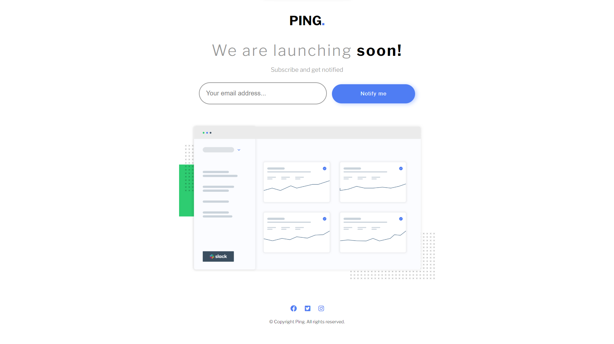
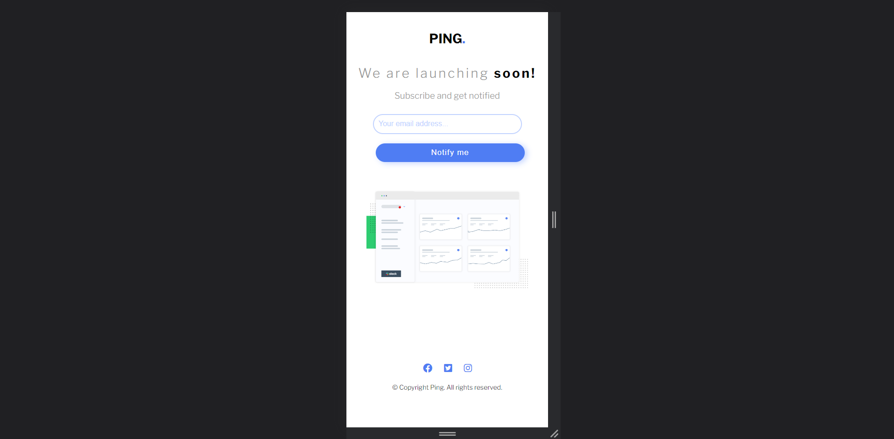

# Ping-Coming-Soon-Page

# Frontend Mentor - Ping coming soon page solution

This is a solution to the [Ping coming soon page challenge on Frontend Mentor](https://www.frontendmentor.io/challenges/ping-single-column-coming-soon-page-5cadd051fec04111f7b848da). Frontend Mentor challenges help you improve your coding skills by building realistic projects. 

## Table of contents

- [Overview](#overview)
  - [The challenge](#the-challenge)
  - [Screenshot](#screenshot)
  - [Links](#links)
- [My process](#my-process)
  - [Built with](#built-with)
  - [What I learned](#what-i-learned)
  - [Continued development](#continued-development)
  - [Useful resources](#useful-resources)
- [Author](#author)

## Overview

### The challenge

Users should be able to:

- View the optimal layout for the site depending on their device's screen size
- See hover states for all interactive elements on the page
- Submit their email address using an `input` field
- Receive an error message when the `form` is submitted if:
	- The `input` field is empty. The message for this error should say *"Whoops! It looks like you forgot to add your email"*
	- The email address is not formatted correctly (i.e. a correct email address should have this structure: `name@host.tld`). The message for this error should say *"Please provide a valid email address"*

### Screenshot




### Links

- Solution URL: (https://github.com/AmanGupta1703/Ping-Coming-Soon-Page)
- Live Site URL: (https://amangupta1703.github.io/Ping-Coming-Soon-Page/)

## My process

### Built with

- Semantic HTML5 markup
- CSS custom properties
- Flexbox

### What I learned

```css
.user-email-id::placeholder {
        color: var(--pale-blue);
}
.subscribe {
    color: var(--gray);
    font-size: 15px;
    margin-bottom: 1.4rem;
}

.user-email-id {
    border: 2px solid var(--gray);
    border-radius: 40px;
    font-size: 1rem;
    padding: 3%;
    width: 20rem;
    outline: none;
}

.error-message {
    color: var(--light-red);
   display: none;
   font-style: italic;
   font-size: 0.8rem;
   margin-top: 6px;
   position: relative;
   right: 9%;
}

.error {
    border: 2px solid var(--light-red);
}
```
```js
function validate() {
  if (email.value.match(mail_check_pattern)) {
    error_message.classList.add(".success");
    error_message.innerHTML = "Notification will be send to your email-id";
  } else if (!email.value.match(mail_check_pattern)) {
    error_message.innerHTML = "Whoops! It looks like you forgot to add your email";
    email.classList.add("error");
    error_message.classList.add = "error-message";
    error_message.style.display = "block";
  }
}
```

### Continued development
1) JS
2) Pseudo Elements

### Useful resources

- [MDN -> Position](https://developer.mozilla.org/en-US/docs/Web/CSS/position)
- [MDN -> ::placeholder](https://developer.mozilla.org/en-US/docs/Web/CSS/::placeholder)
- [Web Dev Simplified](https://www.youtube.com/c/WebDevSimplified)

## Author

- Website - [Ping Coming Song Page](https://amangupta1703.github.io/Ping-Coming-Soon-Page/)
- Frontend Mentor - [@AmanGupta1703](https://www.frontendmentor.io/profile/AmanGupta1703)
